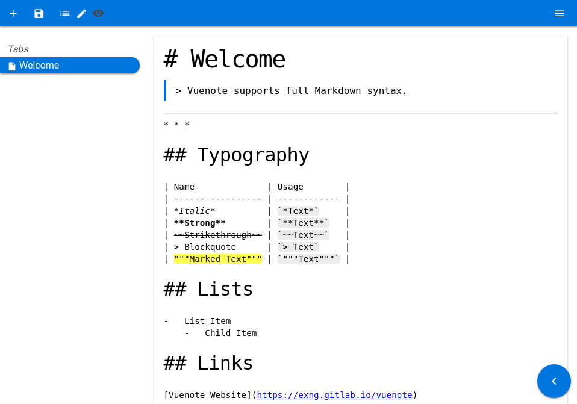

# NotAWiki

> Not A Wiki is the simplest Wiki Engine.



-    Preview Markdown
-    Archive Notes
-    Beautify Markdown
-    Handy Unicode replaces
-    Superscript for math equations

## Markdown

```code support
# Use any markdown style
$ yarn
$ yarn build

# With public path (See: https://quasar-framework.org/guide/app-quasar.conf.js.html#build-Property)
$ PUBLIC=vuenote yarn build
```

## Dev

```bash
# Install dependencies and open dev page build with hot reload
$ yarn
$ yarn dev
```

## Changelog

The file called `CHANGELOG` contains all commits.

```bash
# Update CHANGLEOG file from master
$ git log > CHANGELOG
```

## License

[MIT](http://opensource.org/licenses/MIT)

Copyright (c) 2018-present, Johann Behr
